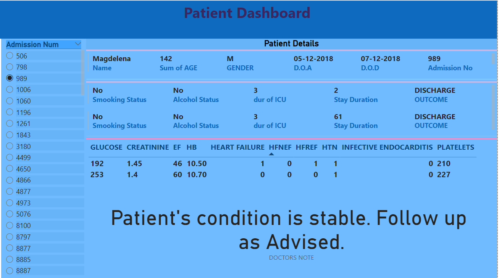

# Healthcare Dashboard

The dashboard provides a comprehensive overview of patient details, including medical history, vital signs, and test results, all in one place. With the ability to filter and drill down into specific patient records, healthcare professionals can quickly identify trends and patterns, make informed decisions, and improve patient outcomes. Our patient details dashboard is a powerful tool that enhances patient care and streamlines clinical workflows.

